# rpl.ai

**The HP 48/49/50 RPL calculator, rebuilt for the screen in front of you.**

rpl.ai is a programmable RPL calculator that runs in any modern browser and
keeps working offline. It implements the HP 50g's User-RPL language and most
of its command set: 452 commands, exact big-integer and rational arithmetic,
units, lists, matrices, programs and directories. It swaps the 131×80 LCD
for a high-resolution stack, a real keyboard, mouse or touch screen, and the
[Giac](https://www-fourier.univ-grenoble-alpes.fr/~parisse/giac.html)
computer algebra system. Giac is the work of Bernard Parisse, who also wrote
the CAS inside the HP 49 and 50g.

**[Open rpl.ai](https://praevitium.github.io/rpl.ai/)**. There is nothing to
download, no account and no sign-up. Install it as an app from the Help menu
and it opens like any other app, with no network needed.

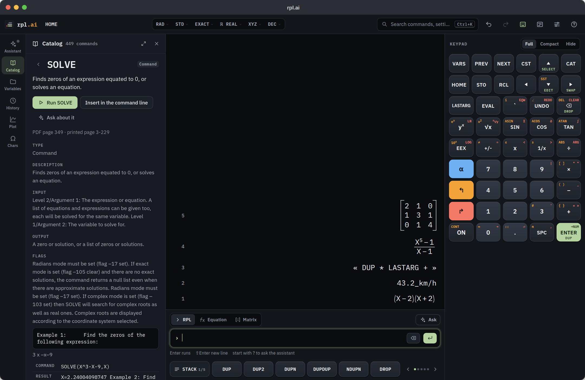

- **The HP 50g you know, where you can see it.** Stack, soft menus, shifted
  keys, VARS, CST, MODES, directories and `HALT`/`CONT` debugging, each
  reachable from a labelled control.
- **Keyboard first, mouse and touch friendly.** Type anywhere to enter.
  `⌘K` (Ctrl+K) searches everything, and every soft key, level and menu
  works with a click or a tap. Swipe a level sideways to drop it.
- **An equation writer that thinks with you.** Type `(x^5-1)/(x-1)` and it
  typesets as you go. Underneath, it shows the value, a plot, the
  simplification, the factorisation, the derivative, the zeros and even
  removable singularities.
- **Previews before you commit.** Hover a soft key to see what it will do to
  your stack, and why it would fail if it can't run.
- **Errors that explain themselves.** "SIN can't use a string." The
  offending level is outlined, one-click fixes are offered, and nothing is
  lost.
- **A tutor, not just an answer engine.** The optional assistant turns a
  physics or maths problem into steps you work through on your own stack.
  It checks each step and gives hints before it gives answers. It runs on a
  model you choose, on your own computer or through Ollama's cloud.
- **Installable and offline.** Plain static files with no server behind
  them. Once loaded, it runs without a network.

**Contents:** [Get started](#get-started) ·
[Five minutes with RPL](#five-minutes-with-rpl) · [Tour](#tour) ·
[Set up the assistant](#set-up-the-assistant) ·
[Limitations](#limitations) · [For developers](#for-developers) ·
[Why this exists](#why-this-exists)

---

## Get started

1. **Open [praevitium.github.io/rpl.ai](https://praevitium.github.io/rpl.ai/)**
   in Chrome, Edge, Firefox or Safari, on a computer, tablet or phone.
2. **Install it (optional).** Choose Help › Install as an app. The browser
   asks you to confirm, or rpl.ai tells you where the browser keeps its
   install command:
   - Chrome and Edge: the install icon at the right of the address bar.
   - Safari on a Mac: File › Add to Dock.
   - iPhone and iPad: Share › Add to Home Screen.
   - Android: the browser menu's Add to Home screen or Install app.
   - Firefox can't install web apps, but rpl.ai works in a Firefox tab,
     offline included.
3. **Take the tour.** A short tour runs the first time. Replay it from
   Help › Take the tour.

After the first visit, rpl.ai runs offline. When you are online it checks
for a new version, and an installed copy offers to reload when one is
ready.

Your stack, variables and settings stay in this browser on this device.
Nothing is uploaded. Two windows of the same browser share them and stay in
step. To move them to another browser or keep a copy, use Back up everything
in the Variables drawer, and Restore from file on the other side.

### Five minutes with RPL

RPL puts the numbers first and the operation last. Each value goes on the
**stack**, and a command takes its arguments from the bottom of it.

- **Arithmetic.** Type `24` Enter `15` Enter, then press × on the keypad
  (or type `*` and Enter) for `360`. A whole line works too:
  `2 3 + 4 *` gives `20`. Fractions stay exact: `1/3 2/5 +` gives `11/15`.
- **Algebra.** Push `` `X^2-4` `` and run `FACTOR` for `(X−2)(X+2)`, or
  `` `X^2-5*X+6=0` `X` SOLVE `` for `{ X=2 X=3 }`. The ` key stands in for
  the HP's ' key, and the command line reads apostrophes too: `'X^2-4'`
  is the same object. Or press `⌘E`, type `x^2-5x+6=0`, and click the Solve
  card.
- **Programs.** `` « DUP * » `SQUARE` STO `` stores a program; `5 SQUARE`
  then gives `25`, and SQUARE appears on the VARS menu. A stored program
  runs by name like a built-in. Built-in names such as `SQ` are reserved.
- **Local variables.** `« 2 3 → a b « a b + a b * » » EVAL` leaves `5` and
  `6`.
- **Units.** `100_km 2_h /` gives `50._km/h`; then `1_m/s CONVERT` gives
  `13.8888888889_m/s`. SI prefixes work on SI units (`5_kJ`, `1_MHz`,
  `3_uA`), and a bare `°C` or `°F` converts as a thermometer reading:
  `100_°C 1_°F CONVERT` gives `212._°F`. The UNITS menu groups the units as
  on the HP 50g (LENG, AREA, VOL, TIME, SPEED, MASS, FORCE, ENRG, POWR, PRESS,
  TEMP, ELEC, ANGL, LIGHT, RAD), with a key for each. A unit key multiplies
  level 1 by the unit, ↰ converts level 1 to it and ↱ divides by it, so `5` ft
  then ↰ m gives `1.524_m`. SIN, COS and TAN take an angle unit, which
  overrides the angle mode: `30_° SIN` gives `0.5` whatever DEG, RAD or GRD
  says.
- **The stack.** Click a level to select it; its actions appear on the row
  and in the menu bar. Double-click edits it in the right writer. Drag rows
  to reorder them.

### Keyboard

On Windows and Linux, ⌘ is Ctrl and ⌥ is Alt.

| Keys | Does |
|---|---|
| `⌘K` | Search commands, settings, variables and help |
| `⌘E` · `⇧⌘M` | Equation writer · Matrix writer (press again to carry it to the command line) |
| `⌘I` | Ask the assistant (or start a line with `?`) |
| `F1`–`F6` · PgUp/PgDn | Soft keys · menu pages |
| `↑` · `↓` on an empty line | Select level 1 · edit level 1 |
| Enter · ⌫ · `→` on an empty line | DUP · DROP · SWAP |
| With a level selected | `↑` `↓` move the selection · `⌘↑` `⌘↓` move the level · Enter edits · ⌫ drops · `⌘C` copies · `⌘D` picks |
| `⌘Z` · `⇧⌘Z` | Undo · redo (text when the line has text, otherwise the stack) |
| `⌘\` · `⌘;` · `⇧⌘F` | Tools drawer · keypad · Minimal view |
| `⌘,` · `⌘/` | Settings · every shortcut, grouped by where it applies |
| Tab | Complete a command or variable name; next box or next cell in the writers |
| Esc | Close, deselect, dismiss, or cancel with Undo |

Hold ⌥ (Alt) to see each keypad key's keyboard shortcut.

### Touch

- The on-screen keypad has the HP 50g's layout, shift keys included.
- Swipe a stack level left or right to drop it. The toast's Undo brings it
  back.
- ⌫ and Enter sit beside the command line. ⌫ deletes a character (or the
  selected text), or drops level 1 when the line is empty.
- A long soft-key name such as `ISPRIME?` wraps onto two lines on a narrow
  screen instead of being cut off.
- The equation writer has its own row of buttons (move, fraction, power,
  root and parentheses), and so does the matrix writer (previous cell, next
  cell and next row), each with ⌫ and Enter.
- Opening the equation or matrix writer brings up your phone's keyboard, and
  so does tapping the equation. While the keyboard is up, the calculator
  keypad steps aside so the writer stays in view.

---

## Tour

### The equation writer

Type maths the way you'd say it: `/` makes a fraction, `^` an exponent,
`(` a group that closes itself, `sqrt(` or `sin(` a function, and `pi`
becomes π. After a filled exponent, `+`, `-` and `=` carry on after the
power, so `(x^5-1)/(x-1)` types as written; Tab leaves any box. Click to
place the cursor. Select a part with a drag, `↑`, ⇧← ⇧→, or a click on a
fraction bar or root sign, and a toolbar evaluates, simplifies, expands,
factors or differentiates just that part.

The insight strip underneath recomputes as you type, and one click applies
a result or opens the plot. Its algebra runs in the background, so typing
never waits on it, and a result that takes more than 3 seconds is skipped.
Enter pushes the expression, or replaces the level you were editing. Esc
cancels, with Undo. Switch to RPL and the formula moves to the command line.

To use a formula in a document, **Copy as LaTeX** in a stack level's menu
copies any value as LaTeX source, and the ↰ layer of the writer's COPY soft
key copies the selection, or the whole expression. Quotients become `\frac`,
roots `\sqrt`, and Σ and ∫ become `\sum` and `\int`; matrices become
`bmatrix`, rationals fractions and units upright text. Programs, directories
and graphics have no LaTeX form, and LaTeX isn't read back in.

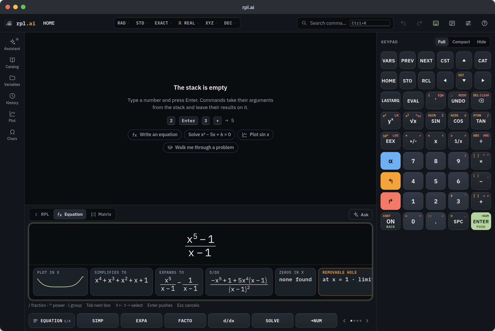

### Walk me through a problem

In Tutor mode the assistant plans a solution as a few steps, and the
calculator dry-runs every step before you see it. Each step explains the idea
and shows the keystrokes. Press **Show me** to watch it happen, or
**I'll do it** to press the keys yourself; the tutor checks your stack and
says what's off. Hints come in stages. Start it from the Tutor switch in the
assistant, or Walk me through a problem in the Help menu. Choose Socratic or
Direct in Settings.

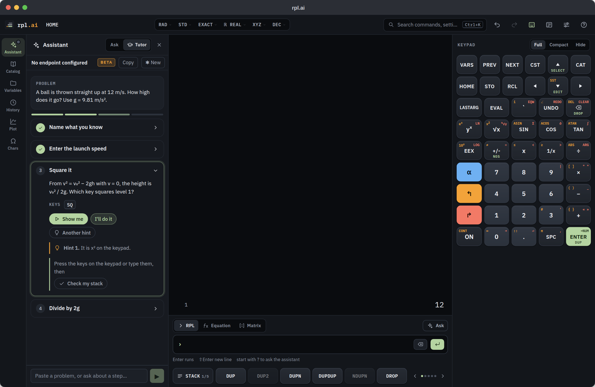

### Know what a key will do

Hover a soft key or a Catalog Run button and the stack shows the arguments
it will take and the results it will leave, computed on a copy of your
stack. If it would fail, the culprit level is outlined and the reason shown.
Keys that need more arguments than the stack holds are dimmed. Previews
cover quick stack commands; algebra commands are not previewed.

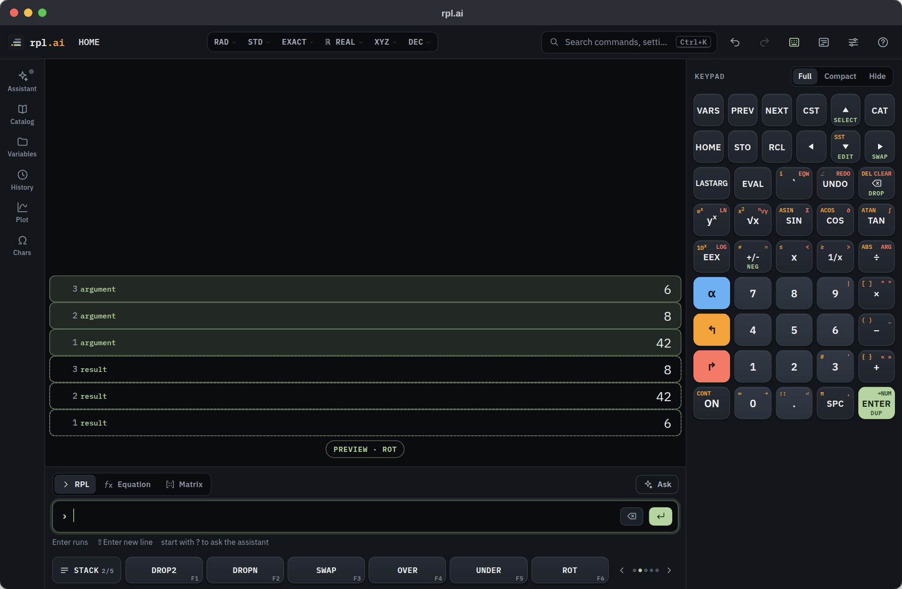

### Errors that help

Every error says what happened, why, and where. The culprit level is
outlined, the command's stack diagram is quoted, and fixes are one click
away: drop the bad value, swap levels, open the reference, or ask the
assistant to explain. A failed command leaves the stack as it was.

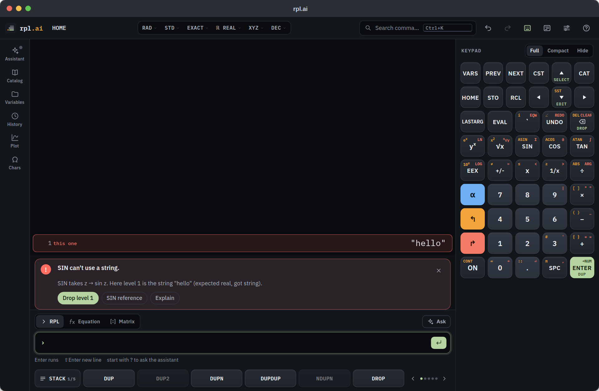

### Plots you can work with

`FUNCTION`, `POLAR`, `PARAMETRIC`, differential equations, scatter, bar and
histogram plots. Traces have checkboxes and editable expressions. Zoom, fit
and reset are on the canvas, the window is typed in directly, and Trace mode
(`T`) walks a cursor along the curves with live readouts. Expand to fill the
window, or go full screen.

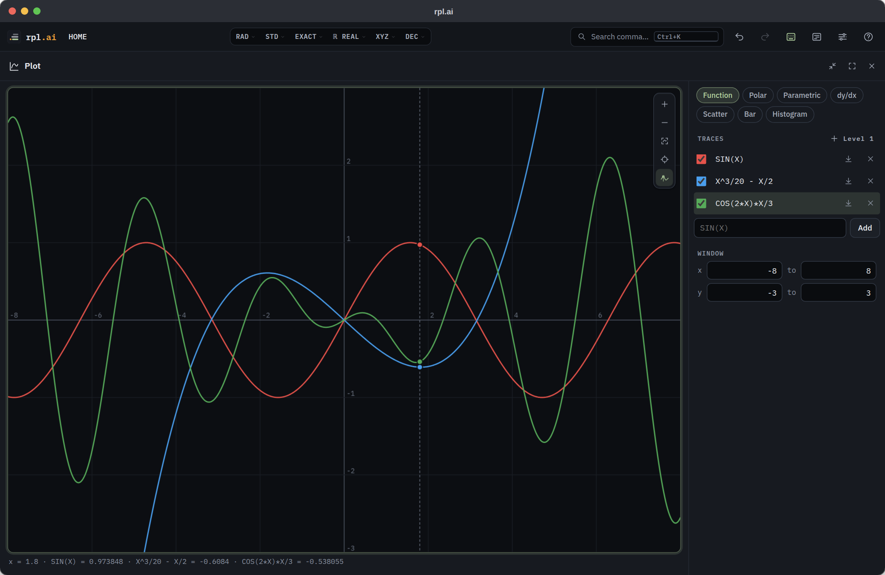

### Search everything

`⌘K` finds commands (by name, description or topic), settings, modes, menus,
variables and constants. For quick commands, the selected result shows what
it would leave on your stack; `→` opens its reference page.

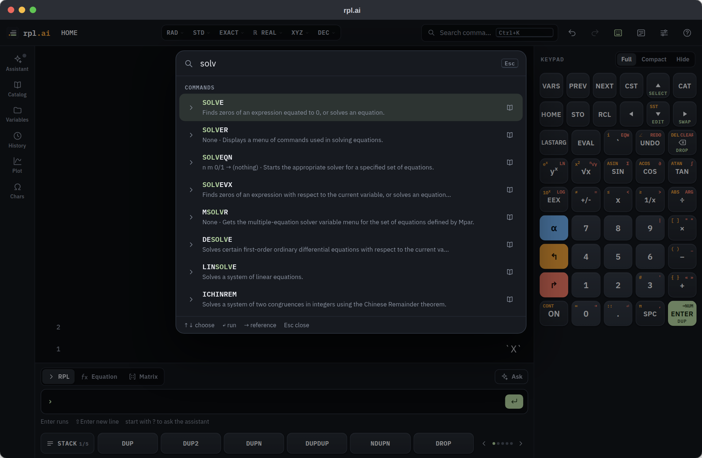

### Variables and directories

Browse, run, recall, edit, rename, move and download variables. Drag them to
reorder, into folders or onto the breadcrumb. Back up the stack and the
whole HOME tree to a JSON file and restore it, archive to backup ports, and
import or export HP text files (`.rpl`).

Copy a matrix, vector or list (`⌘C` on a selected level) and paste it into
Excel, Google Sheets or Numbers: it arrives as cells. Copy a range of
numbers from a spreadsheet and paste it on the command line, where it
becomes a matrix (a vector for a single row, a one-column matrix for a
single column), or into the matrix writer's cells. Excel, Sheets and Calc
paste each number at the exact value the sheet holds, not as rounded as the
cell shows it. Currency, percentages, accounting negatives such as
`(300.00)` and the separators of other locales (`1.234,56`) are read as
numbers.

Spreadsheet files work too. Download a matrix, vector or list as `.csv`,
`.tsv` or Excel's `.xlsx` from its download button in the Variables drawer,
or with **Download as…** in a stack level's menu, which offers `.rpl` and
`.json` for any value. Upload a `.csv`, `.tsv`, `.xlsx`, `.rpl`, `.txt` or
`.json` file in the drawer, or drop one anywhere on the calculator to put it
on the stack. A table of numbers becomes a matrix (a vector for one row), a
text row above numbers is taken as a header and skipped, and a table with
other text becomes a list of rows. From a workbook rpl.ai reads the first
sheet's used range; dates arrive as Excel's serial numbers.

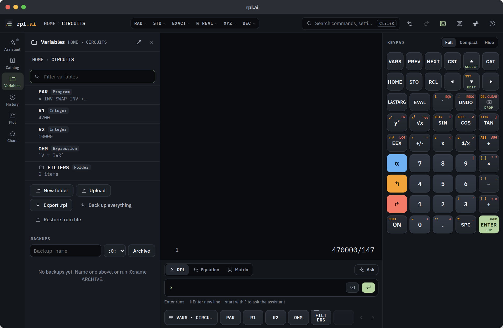

### Debugging

`HALT` suspends a program and shows it with the next instruction
highlighted. Continue, Step or Stop from the banner (or `CONT`, `SST`,
`KILL`). `PROMPT` shows its message and waits for your input.

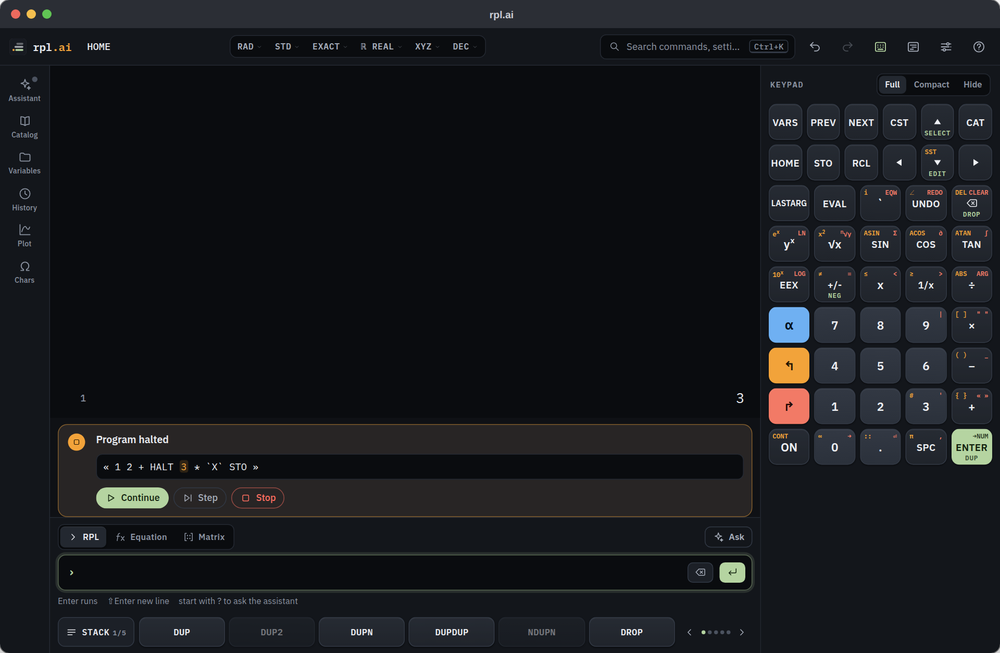

### Three looks, and a Minimal view

Graphite and Paper follow your system's dark or light setting; Classic LCD
reimagines the original display. Minimal view strips everything back to the
status line, the stack and the command line (`⇧⌘F`); a setting keeps the
soft keys.

| Classic LCD | Paper |
|:---:|:---:|
| 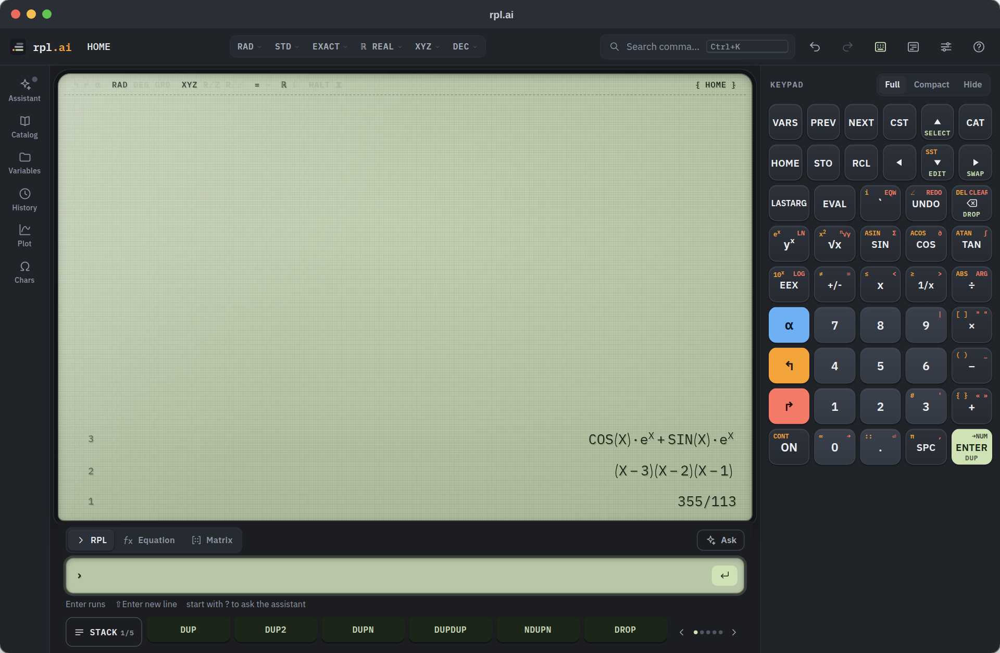 | 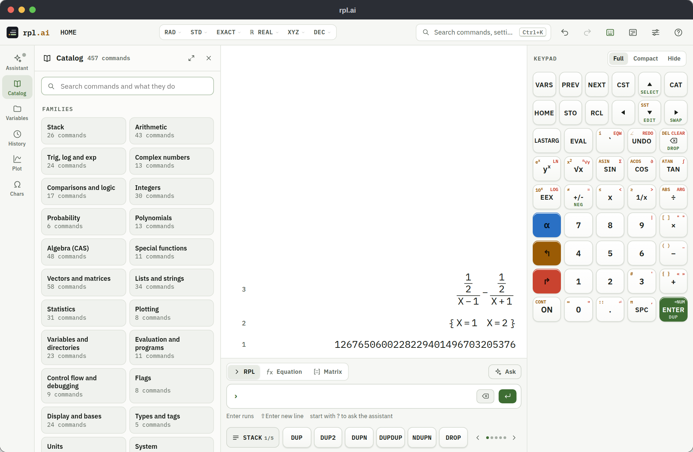 |

| Minimal view | Phone |
|:---:|:---:|
| 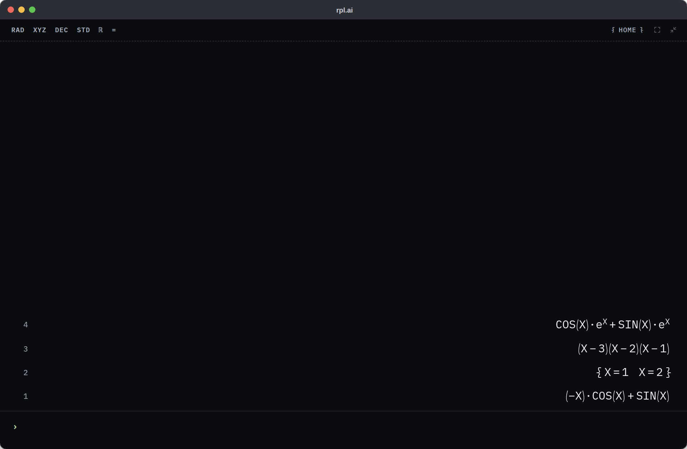 | 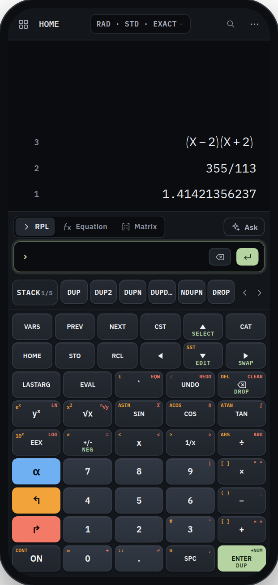 |

---

## Set up the assistant

The calculator needs none of this. The assistant is optional, and nothing
leaves your browser until you connect a model.

It works with [Ollama](https://ollama.com), a free app that runs AI models
on your own computer, and with other OpenAI-compatible servers. Each turn it
reads the live stack, modes and variables, looks commands up in the built-in
HP 50g reference, and dry-runs RPL on a scratch copy of the calculator
before acting for real. Every action is shown as a card, and each turn can
be undone in one click. Error banners and stack levels hand their context to
it with Explain or Ask.

Setup takes about ten minutes plus the model download. Ollama has to run on
a computer (Mac, Windows or Linux); phones and tablets connect to one.

### 1. Install Ollama

- **macOS** (Sonoma 14 or newer): download
  [Ollama.dmg](https://ollama.com/download/Ollama.dmg), drag Ollama to
  Applications and open it. When it first opens, let it install the
  command-line tool. A llama icon appears in the menu bar.
- **Windows** (10 22H2 or newer): run
  [OllamaSetup.exe](https://ollama.com/download/OllamaSetup.exe). No
  administrator rights are needed. Ollama then runs in the background, with
  an icon in the system tray. Open a *new* PowerShell or Terminal window
  afterwards so the `ollama` command is found.
- **Linux**: in a terminal, run
  ```sh
  curl -fsSL https://ollama.com/install.sh | sh
  ```
  It asks for your sudo password. If it says zstd is required, install it
  (`sudo apt-get install zstd`, `sudo dnf install zstd` or
  `sudo pacman -S zstd`) and run it again. On systems with systemd it
  installs and starts a service named `ollama`; without systemd, start
  Ollama yourself with `ollama serve`.

To check it, open <http://localhost:11434>. It should say
**Ollama is running**.

### 2. Get a model

The assistant works best with a model that supports **tools**, and larger
models follow RPL better. Pick one:

| Model | Where it runs | What you need |
|---|---|---|
| `qwen3.5` | your computer | about 14 GB of GPU memory or Mac unified memory |
| `gemma4` | your computer | about 12 GB |
| `gpt-oss:20b` | your computer | about 16 GB |
| `qwen3.5:cloud`, `gpt-oss:120b-cloud` | Ollama's servers | an ollama.com account; see [Cloud models](#cloud-models) |

Download a local one with, for example:

```sh
ollama pull qwen3.5
```

`ollama ls` lists your models, and `ollama show <model>` lists `tools`
under Capabilities when the model supports them. Avoid older models such as
`llama3.1`, `llama3.2` and `mistral`; Ollama itself flags them as poor at
this kind of tool use. On a computer without a capable GPU, local models
are slow; a cloud model is the better choice there.

### 3. Let rpl.ai talk to Ollama

Ollama answers only web pages it trusts. It trusts `localhost` out of the
box, so it needs to be told about the hosted app. Set `OLLAMA_ORIGINS` to
exactly `https://praevitium.github.io`: no `/rpl.ai`, no trailing slash.
(For more than one origin, separate them with commas and no spaces; a
malformed entry can stop Ollama from starting.) Then **quit Ollama
completely and start it again**. A running Ollama doesn't see the change.

- **macOS**: in Terminal, run
  ```sh
  launchctl setenv OLLAMA_ORIGINS "https://praevitium.github.io"
  ```
  Then click the menu-bar icon, choose **Quit Ollama**, and open Ollama
  again from Applications. This setting is lost when you restart or log
  out, and Ollama starts at login without it, so after a restart run the
  line again and quit and reopen Ollama.
- **Windows**: quit Ollama from the tray icon. Open Settings (Windows 11)
  or Control Panel (Windows 10), search for "environment variables", and
  choose **Edit environment variables for your account**. Click **New**,
  enter the name `OLLAMA_ORIGINS` and the value
  `https://praevitium.github.io`, and click OK. Start Ollama again from the
  Start menu.
- **Linux** (systemd service): run `sudo systemctl edit ollama`. In the
  editor, between the two `###` comment lines near the top, type
  ```ini
  [Service]
  Environment="OLLAMA_ORIGINS=https://praevitium.github.io"
  ```
  Save, exit, and run `sudo systemctl restart ollama`. If `OLLAMA_ORIGINS`
  is already set there, add the origin to that value instead.
- **Running `ollama serve` yourself** (macOS or Linux):
  `OLLAMA_ORIGINS=https://praevitium.github.io ollama serve`.

To confirm it worked, run this (on Windows, type `curl.exe`):

```sh
curl -i -H "Origin: https://praevitium.github.io" http://localhost:11434/api/version
```

A reply with `Access-Control-Allow-Origin: https://praevitium.github.io`
means it worked. `403 Forbidden` means Ollama wasn't restarted or the value
is mistyped.

Don't use `OLLAMA_ORIGINS=*`: it lets every website you visit use your
Ollama.

### 4. Connect

1. In rpl.ai, choose Help › Ask the assistant (`⌘I`) and click
   **Enable assistant**.
2. Click **+ Add endpoint**. The address is already
   `http://localhost:11434/v1`; your models appear in the list once Ollama
   answers.
3. Pick a model and click **Add & connect**.

The first time, your browser may ask whether the page may reach other apps
and services on this device (Chrome, Edge and Firefox word it slightly
differently). Choose **Allow**; the connection needs it. If you blocked it,
click the icon to the left of the address, allow **Apps on device** (or
**Local network access**) and reload.

**Safari, and every browser on iPhone and iPad, can't do this step.** They
block a secure page from calling `http://localhost`, with no prompt and no
setting to change it. Use Chrome, Edge or Firefox on the computer, or run
rpl.ai yourself (below).

The assistant asks for a 32K-token context by default. On a computer with
little memory, choose 8K or 16K under Context in the endpoint settings.
Thinking models reason before answering unless you turn that off there.
Ollama models that support tools get native tool calling; others write
their tool calls as text.

### Cloud models

Ollama can run very large models on its own servers, so your computer only
relays the requests. rpl.ai still talks to **your** Ollama, which needs the
steps above.

1. Create a free account at [ollama.com](https://ollama.com).
2. On the computer running Ollama, run `ollama signin` and approve the
   connection in the browser window it opens. (On a Mac or Windows PC, the
   Ollama app's Settings can sign you in too.)
3. Add a cloud model so it shows in rpl.ai's list. This fetches only a tiny
   placeholder:
   ```sh
   ollama pull qwen3.5:cloud
   ```
   Cloud model names end in `-cloud` or `:cloud`. Browse them at
   [ollama.com/search?c=cloud](https://ollama.com/search?c=cloud).
4. In rpl.ai, open the endpoint settings and pick the cloud model.

The free plan includes a small monthly allowance; more use needs credits or
a paid plan ([pricing](https://ollama.com/pricing)). Ollama says it doesn't
store cloud prompts or train on them. Local models never leave your
computer.

rpl.ai can't use Ollama's hosted API (`https://ollama.com/v1`) directly.
Browsers can't call it from a web page, and Ollama asks that API keys stay
out of browser code. The app says so if you try.

### Other setups

- **Run rpl.ai yourself.** With [Node.js](https://nodejs.org) installed,
  clone this repository, run `npm install` once and `npm run serve`, and
  open **http://localhost:5050**. From `localhost` every browser works,
  Safari included, and Ollama needs no `OLLAMA_ORIGINS`.
- **Ollama on another computer.** On that computer, turn on
  Settings › Expose Ollama to the network (Mac and Windows app), or add
  `Environment="OLLAMA_HOST=0.0.0.0:11434"` to the Linux service. Connect
  to `http://<its address>:11434`. A secure page can't call a plain-HTTP
  address on your network, so either open rpl.ai over plain HTTP from a
  server you run (and add that page's origin to `OLLAMA_ORIGINS`), or put
  Ollama behind HTTPS. Anyone on your network can use an exposed Ollama.
- **Other OpenAI-compatible servers** work if they accept requests from a
  web page. Put an API key in the endpoint settings if the server needs
  one.

### If it doesn't connect

The endpoint form explains the failure it sees:

| It says | Do this |
|---|---|
| Waiting for your browser | Find the browser's prompt about apps and services on this device, near the address bar, and choose **Allow**. Until you answer it, nothing reaches Ollama |
| Your browser is blocking this page | You chose Block earlier: click the icon to the left of the address, allow **Apps on device** (**Local network access** in older Chrome, **Device apps and services** in Firefox) and try again |
| answered but refused this page's origin | Set `OLLAMA_ORIGINS` (step 3), then quit and restart Ollama |
| Nothing answered | Check that Ollama is running (<http://localhost:11434>) |
| Safari … blocks HTTPS pages | Use Chrome, Edge or Firefox, or run rpl.ai yourself |
| served over HTTPS … blocks plain-HTTP requests | See "Ollama on another computer" above |
| `unauthorized` from a cloud model | Run `ollama signin` on the computer running Ollama |

---

## Limitations

rpl.ai aims to keep everything that makes the HP 50g good, without its
bugs, and to go beyond it where a modern screen helps. It isn't finished,
and these are the gaps worth knowing about.

**Commands.** The HP 50g manual lists 810 commands; rpl.ai has 452. The
Catalog and the command reference mark what is available. Not there yet:

- program I/O: INPUT, INFORM, CHOOSE, DISP, CLLCD, FREEZE, MSGBOX, WAIT,
  KEY and BEEP. Programs read their arguments from the stack, label results
  with `→TAG` and pause with `PROMPT`.
- PICT and the plot-setup commands (PVIEW, ERASE, AXES, XRNG, YRNG, STEQ and
  the rest)
- the ΣDAT commands (Σ+, CLΣ, XCOL, YCOL, NDIST and the rest)
- MENU and TMENU, DEF and DEFINE
- parts of the CAS, such as TAYLR, SERIES, DESOLVE, LINSOLVE, LDEC and
  ZEROS (SOLVE and ISOL are here)
- most of the unit catalog: the SI units with their prefixes, the
  temperatures, the angles and about 100 common units are here, but not the
  rarer ones (viscosity, for one) or units inside algebraics

**Left out on purpose.** USER mode and key assignments, ENTRY mode, the
NUM.SLV solver screens, FINANCE, TIME, OFF, libraries (LIB, ATTACH and
port management other than ARCHIVE and RESTORE), Saturn assembly and
System RPL, and IR and serial transfer.

**Behaviour that differs from the HP 50g.**

- Statistics commands take a vector, or a matrix of columns, from the stack
  instead of reading ΣDAT.
- Plot commands open the plot view instead of drawing into PICT.
- There is no ON key to break a running program. A command or program that
  runs longer than 10 seconds is stopped, the stack is put back, and the
  error says why. A loop stops after 1,000,000 passes.
- `RCLF` returns the numbers of the set flags as a list, and `STOF` takes
  that list back, instead of the HP's binary-integer flag words.
- A local variable is visible to programs called from its body; on the HP
  only `←` names are.

**The algebra engine.** Giac is not the HP 49/50's CAS, so answers can come
back in a different but equivalent form. It is an 11.8 MB download, fetched
once. One CAS command, such as factoring a huge polynomial, can't be
interrupted: the page stops responding until it finishes. The equation
writer's insights and the previews never wait on it.

**Your data.** The stack and variables live in this browser's storage on
this device. They don't sync, and clearing the site's data, or closing a
private window, erases them. If the browser blocks site data altogether,
rpl.ai still runs but warns that nothing is being saved. Back them up with
Back up everything in the Variables drawer. Spreadsheets exchange CSV, TSV
and `.xlsx` files and copied cells; of a workbook only the first sheet is
read, and formulas arrive as their last calculated values.

**The assistant.** It is only as good as the model you connect, and small
models make mistakes in RPL; check its work, and use Undo freely. It needs
Ollama or a compatible server, it can't use ollama.com's API directly, and
Safari and iPhone or iPad browsers can't reach a local Ollama from the
hosted app.

**Browsers.** Firefox runs rpl.ai but can't install it as an app. The first
visit needs a network connection; after that it works offline.

---

## For developers

```bash
npm install      # one-time setup
npm run serve    # http://localhost:5050
```

The app is the static files in `www/`: plain ES modules with no bundler.
`www/precache.js` and `www/src/build-info.js` are generated by
`npm run build-info`, which `npm install`, `npm run serve` and the Pages
deploy run for you; they are not checked in. Any static web server can
host `www/` after that. Browsers won't run it from `file://`, because ES
modules and the Giac WebAssembly need http(s), and they install it and keep
it offline only over https or on localhost. Every push to `main` publishes
`www/` to GitHub Pages.

### Project layout

```
www/                  The app: static files served as-is
  index.html          Shell and icon sprite
  sw.js               Offline cache (the precache list is generated)
  src/app.js          Wires the UI together
  src/rpl/            Stack engine, parser, evaluator, formatter, persistence
  src/rpl/ops/        Command families; src/rpl/ops.js re-exports the registry
  src/rpl/cas/        Giac adapter and AST↔Giac conversion
  src/ui/             Stack display, input and writers, menus, keypad, drawers, plots, search
  src/ai/             Assistant: chat, tools, tutor, endpoint client
  css/                Design tokens, themes and components
  docs/               HP 50g command reference behind the Catalog and help
  fonts/              IBM Plex subsets
  icons/, manifest.webmanifest   App icons and install manifest
  hp50-all.json       Example variables loaded on first launch
  vendor/             Giac, decimal.js, fraction.js, complex.js, CodeMirror, KaTeX, Mermaid
tests/                Node test suites, one area per file
scripts/              Build info, offline precache, README screenshots, command-reference upkeep
screenshots/          Images used above
utils/                Pre-commit hook: sanity smoke, optional full and persist suites
.github/workflows/    Publishes www/ to GitHub Pages on every push to main
```

Shipped commands are the `register` calls under `www/src/rpl/ops/`.

### Testing

The tests are plain Node ES modules with no framework:

```bash
npm test                                  # every area except persistence
node tests/test-persist.mjs               # save, load, export and backups
node tests/test-equation-editor.mjs       # one area
node tests/flake-scan.mjs                 # rerun the suite to catch flaky results
node tests/flake-bisect.mjs --label "…"   # find the file order that breaks an assertion
```

In Node the CAS answers come from Giac fixtures each test registers; the
real Giac WebAssembly runs only in the browser.

`npm run screenshots` regenerates the images in this README. It drives a
local Chrome through Playwright (`CHROME_PATH` points it at another
browser). Name scenes to redo only those: `npm run screenshots -- hero
phone`. `RPLAI_SCREENSHOT_LLM` and `RPLAI_SCREENSHOT_MODEL` add the
assistant scene.

What changed is in [RELEASE_NOTES.md](RELEASE_NOTES.md).

---

## Why this exists

I've always loved the HP 48/49/50 interface. RPL's stack makes a calculation
read the way you'd work it by hand: operands first, then the operation. User
programs are first-class: store one under a name and it behaves exactly like
a built-in. The hardware aged. Emulators kept the 131×80 screen, and the HP
Prime left too much of the language behind. I wanted RPL with a big screen,
a real keyboard, deep undo and a proper file manager. When AI-assisted
development made a project of this scope practical, rpl.ai is what came out
of it.

## Acknowledgements

rpl.ai bundles or depends on:

- **[Giac](https://www-fourier.univ-grenoble-alpes.fr/~parisse/giac.html)**
  (GPL-3.0+): Bernard Parisse's computer algebra system, as WebAssembly via
  [emgiac](https://github.com/adriweb/emgiac), with GMP, MPFR and MPFI (LGPL)
- **[decimal.js](https://github.com/MikeMcl/decimal.js)**,
  **[fraction.js](https://github.com/rawify/Fraction.js)** and
  **[complex.js](https://github.com/rawify/Complex.js)** (MIT): decimal,
  rational and complex arithmetic
- **[CodeMirror 6](https://codemirror.net/)** (MIT): the command line
- **[KaTeX](https://katex.org/)** (MIT): math in the assistant's replies,
  and the ∠ glyph
- **[Mermaid](https://mermaid.js.org/)** (MIT): diagrams in the assistant's
  replies
- **[IBM Plex](https://www.ibm.com/plex/)** (OFL): the typefaces

See [NOTICE](NOTICE) for full attribution.

## License

rpl.ai is licensed under the **GNU General Public License v3.0 or later**
(`SPDX-License-Identifier: GPL-3.0-or-later`); see [LICENSE](LICENSE).
Because Giac is GPL-3.0+, the combined work must be distributed under
GPL-3.0-or-later, and can't be relicensed more permissively while Giac is
bundled.

*HP, HP 48, HP 49, HP 50g and HP Prime are trademarks of HP Inc. rpl.ai is
an independent reimplementation, not affiliated with or endorsed by HP.*
